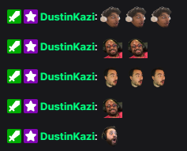

# PogChamp Universe

A browser extension that automatically replaces the phrase 'PogChamp' with various PogChamp-style faces from around the Universe :)

Coded By [Faheem "DustinKazi"](https://lksg.me/u/fdquazi)

- [PogChamp Universe](#pogchamp-universe)
  - [How it Works](#how-it-works)
    - [Make it only work when I want it!](#make-it-only-work-when-i-want-it)
  - [Who's part of that selection?](#whos-part-of-that-selection)
    - [From the Articles or Twitter feed](#from-the-articles-or-twitter-feed)
    - [Friends](#friends)
    - [Added after initial release](#added-after-initial-release)
  - [Where it works (for sure)](#where-it-works-for-sure)
  - [Can I add myself?](#can-i-add-myself)
  - [Can I remove myself?](#can-i-remove-myself)
  - [Future Plans](#future-plans)
  - [References](#references)

## How it Works

When you install the extension, it comes with a small selection of images. Each time the extension detects the word "PogChamp" (case-insensitive) on a page, it replaces the word with one of those images. For now, it uses the standard 28x28 pixel size when replacing text.

### Make it only work when I want it!

Soon(tm), for now try this:

- Right click on the extension icon (currently says "PCU")
- Select "This can read and change site data", then "When you click the extension"
- When you do that, clicking the extension icon will enable it for that page for the session
  - You'll have to click it each time you visit a page though...

## Who's part of that selection?

This initial list was made arbitrarily based on who I knew either had a Pog-style emote, or from the Articles I saw about it.

### From the Articles or Twitter feed

- [LiquidHBox](https://twitter.com/LiquidHBox)
- [Tossler_](https://twitter.com/Tossler_)
- [Kripparrian](https://twitter.com/Kripparrian/status/1347008431341907968/photo/1)
- [Kahjahkins](https://twitter.com/Kahjahkins)
- [JackManifoldTV](https://twitter.com/JackManifoldTV)

### Friends

- [qq_cat_](https://twitch.tv/qq_cat_)
- [Wulffy](https://twitter.com/Wulffy281)

### Added after initial release

- TBD

## Where it works (for sure)

- Twitch (of course)
- Twitter (because why not)

## Can I add myself?

Yes! If you're on Twitch/YouTube (not banned) and have a "Pog Style" emote image or design, Tag me [@DustinKazi](https://twitter.com/DustinKazi) on Twitter with the emote attached and "#PogChampUniverse" and I'll add it in :)

If it isn't you yourself that you want to add, that hashtag "#PogChampUniverse" might be a good way to crowdsource good picks for the extension, at least for now.

If enough people use this extension, then I'll figure out a way to make it easier than "me do it manually by looking at who's tagging me".

## Can I remove myself?

Of Course! If it's your face, DM me on Twitter [@DustinKazi](https://twitter.com/DustinKazi) and I'll remove it ASAP. Apologies in advance for the trouble.

## Future Plans

- Ability to Enable/Disable on specific sites.
- Ability to specify a single image to use rather than randomize (i.e. toggle between random and single image)
- Ability to add custom images to local version of extension (i.e. you can add your own images but it'll only show up for yourself)
- Figure out if the code can be further optimized (I literally wrote this in four hours pls forgive lol)

## References

[Tweet by day9tv](https://twitter.com/day9tv/status/1347021857359163393) - The Inspiration to make it
[Polygon Article](https://www.polygon.com/2021/1/7/22218603/twitch-pogchamp-emote-replacement-design-ideas) - List to get an idea
[PC Gamer Article](https://www.pcgamer.com/what-should-replace-the-pogchamp-emote-on-twitch) - Another list
[WebExtension Development Sample](https://github.com/mdn/webextensions-examples/blob/master/emoji-substitution/substitute.js) - A baseline for the code
[Microsoft Docs](https://docs.microsoft.com/en-us/microsoft-edge/extensions-chromium/getting-started/part2-content-scripts) - Big Extension Development Reference
